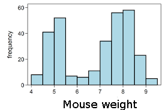
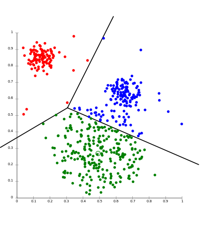

2/11/2015

Lecture 11
Notes

Unsupervised Learning
#### Clustering

Linear vector quantization (LVQ) aka k-means

Example.
You are given a task of calculating an average weight of a mouse in some mouse colony.
How would you approach it? You could measure the weight of every mouse, sum it up and then divide the total by a number of mice measured.

If there are too many mice to measure, you could, perhaps, measure some representative sample of the mouse population and calculate the average based on the sample.

But what would you do if the average was dynamic, for instance, the mice are a subject of the experiment that affects their weight and we want to track the changes to the average weight? Keep in mind, your solution needs to be realistic in terms of data storage we can designate for our calculations.

To calculate a running average we simply need to keep track of the running total and the current count:

> a1,...,at are weights

> St = Σi=1..t ai is a total weight

and then the average weight is calculated as follows:

> At = St/t

if we need to add another mouse's weight the next day we update out total and our count:

> St+1 = St + at+1 

> At+1 = St+1/t+1

In our case, however, if we want to track the changes in the average weight, we may want to only calculate the average weight over the last month.

We want to disregard old data and give more weight to the new data. To do so we can use decaying sum:

Decaying estimate:

> St = at + 0.98 at-1 + (0.98)2 at-2 + ... = Σj=0..∞ (0.98)j at-j 

We call (0.98) in the following example decaying constant and we can denote it as α, s.t 0 < α < 1

We adjust our formulas accordingly:

> St+1 = at+1 + 0.98 St

> At = St/Σj=0..∞ (0.98)j

Now lets say in our example we have 2 subpopulations of mice and they differ by weight. In this situation we would like 2 averages, each calculated for a separate subpopulation.

How can we begin to sort them?

Ideally, we would like to be able to classify a mouse as belonging to one or the other subpopulation and only update the relevant subpopulation average with that weight. But we don't know, when we are given a mouse, which class of mice it belongs to. One algorithm gives us a way around it by creating cluster centers and using the cluster centers for classification.

##### k-means Algorithm.

Using this algorithm we associate the value of every new sample with the value of the cluster center closest to it.

 loop:
> read in xt 

> calculate ĵ = argminj ‖ xt - wj ‖

> wĵ ← α wĵ + (1 - α) xt 

And as we add this new value to some cluster, we update the average value of that cluster and move wj closer to the added value.

As the algorithm progresses, some clusters will starve, some will crawl towards each other, they will not be quite as they were during the initialisation, but resulting clusters will be fairly accurate. 

If we initialise many more clusters than we expect we need , and if they are quite spread out, we can arrive to the correct positioning of cluster centers by throwing away starved ones and joining the ones that are close together.

Usages of k-means:

One example of using this algorithm could be recognition of hand written digits.

Another one - speech recognition.

When the system analyzes speech for each bin it gets a vector( of ~ 128 dimensions) to represent frequencies. It is hard to compute things using 128 dimensions, so instead of this vector analysis works on cluster indices generated for the vectors. When a new user starts using the system, the clusters get updated to suit.

In clean form, however, clustering is rarely used.

It can be used for cell sorter to find abnormal features in tissue, or in biology, clustering samples into species, or purchase history. In real life clustering is combined with other algorithms to improve its accuracy. 
Factors to consider when using clustering algorithms:

- is clustering going to converge?
- will the pull factor lessen with time and will the centers move less?
- will the resulting clusters be correct?
We can use Voronoj diagram to split our space into planes where the points lying in the same plane correspond to its cluster centre:

To find cluster center wj amongst many cluster centers such that x is closest to wj we minimise error E using stochastic gradient on clustering function:

> E = Σt ‖ xt - wĵ ‖2,

 where 
> ĵ = argminj ‖ xt - wj ‖,

hence
> E = Σt minΣj ‖ xt - wj ‖2

