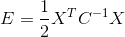

#Matrix decomposition
___

##Recap
___
+ Graphical models and bayes nets => supposedly the future of ml.
+ However inference from graphs is considered an intractible problem.

##Matrix decomposition 
___

+In general matrix decomposition is the factorization of a matrix into a product of matrices. In particular we talk about non-negative matrix 
factorization(NMF), that is we factorize a matrix into two matrices such that all three matrices are element wise non-negative.

+Many problems can be rephrased as matrix decomposition and thus it is a handy tool to have in the machine learning shed.  
  
+Data sets such as images etc. fall into the line of fire of NMF 

###Example
___
Consider the 2D data set 

where y1 and y2 are drawn from gaussian (normal) generators as follows:  

	+y1 ~ g(0;1^2)
	+y2 ~ g(0;2^2)

where a gaussian distribution is parameterised as g(mean; std. dev)

we also have the following energy functions for y1 and y2:  

	+E(y1) = y1^2
	+E(y2) = (y2^2)/4

(for those who are wondering what all this talk of energy functions is about and what they have to do with stats [this](http://www.askamathematician.com/2010/02/q-whats-so-special-about-the-gaussian-distribution-a-k-a-a-normal-distribution-or-bell-curve) might help.)

We can visualise the data using a histogram:  

  

or with a scatter plot:  
 

The physics analog here is the distribution of molecules in 2 different rooms. We want to consider them seperately, then consider the joint distribtution of molecules across the two rooms. 
  
Thus the joint energy of the two samples is:  
  
 	E(y1,y2) = (y1^2) +  (y2^2)/4  

Then we can get the probability of some X across the two gaussians:  

	p(x) = 1/Z(e^-(E(y1,y2)))  
	where Z is the partition function(see previous lectures)  

##Non axial parallel example 
___  
In the case where the distributions are non-axial parallel. For example:  

  
  
There are 2 sources of variation in the data given by ci, where:  
	||ci|| = 1 //ci is a unit vector  
	 λi = amount of std. dev. in direction i

Thus we have another energy function, that describes a 2D gaussian with arbitrary direction:
	  

	where:  
   // [i=j] knuth notation, returns 0 or 1

##Expanding to n-dimensional gaussians
___  
  
How do we expand this concept to n-space?  

Include the lambda's:  
  
where  
  
  

When the distribution(s?) are axial parallel we have: 

  
  
when the the distribution(s?) are not axial parallel the matrix gives you the orientation of the distribution(s?)  
___  
  
Going back to our 2D data set, we have x expressed as a sum:  

##Example  
___
say we have an 8 * 8 matrix X, a 64 * 12 matrix A (the column joined ci's) and a 12*M matrix B  
we want to decompose X (approximately)  S.T:  
  

we find:  
  
i.e. the least squares approach  
with the constraint that:  
  
  
(aside: all major contributions to the field of statistics have been by pyschologists, not statisticians.)  
  
 What if we relax the above constraint (i.e. that the ci's are pairwise orthogonal)?  
 => No unique solution (to what???)  

 For example consider the distributions:  

  
  
  
Usually only one source of variation is non-zero in this case.
This allows for independent component anlaysis

