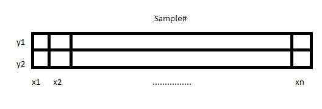

#Matrix decomposition
___

##Recap
___
+ Graphical models and bayes nets => supposedly the future of ml.
+ However inference from graphs is considered an intractible problem.

##Matrix decomposition 
___

+In general matrix decomposition is the factorization of a matrix into a product of matrices. In particular we talk about non-negative matrix 
factorization(NMF), that is we factorize a matrix into two matrices such that all three matrices are element wise non-negative.

+Many problems can be rephrased as matrix decomposition and thus it is a handy tool to have in the machine learning shed.

###Example
___
Consider the 2D data set 

where y1 and y2 are drawn from gaussian (normal) generators as follows:
	+y1 ~ g(0;1^2)
	+y2 ~ g(0;2^2)

where a gaussian distribution is parameterised as g(mean; std. dev)

we also have the following energy functions for y1 and y2:
	+E(y1) = y1^2
	+E(y2) = (y2^2)/4

(for those who are wondering what all this talk of energy functions is about and what they have to do with stats [this](http://www.askamathematician.com/2010/02/q-whats-so-special-about-the-gaussian-distribution-a-k-a-a-normal-distribution-or-bell-curve) might help)
